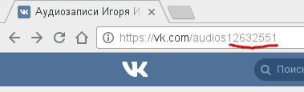

VkSoundOyabun
====

VK Sound Oyabun — это загрузчик аудиотреков из альбомов Vkontakte.
Страничка скрипта на блоге автора — [Загрузка аудио vkontakte на Python (VkSoundOyabun)](http://blog.axisful.info/code/python/VkSoundOyabun).

> Оябун — главная фигура в иерархии якудза ([википедия](https://ru.wikipedia.org/wiki/%D0%AF%D0%BA%D1%83%D0%B4%D0%B7%D0%B0)).


## Установка
1) Скрипт зависит от модуля [vk_api](https://github.com/python273/vk_api):
``` sh
pip install vk_api
```
2) [Скачиваем скрипт](https://github.com/8kto/VkSoundOyabun/archive/master.zip) или клонируем проект гитом:
``` sh
git clone https://github.com/8kto/VkSoundOyabun.git
```
3) Для соединения и просмотра информации из профиля пользователя, VK API требуются ваши логин и пароль,
их нужно добавить в файл config.ini:
``` sh
# Скопируем файл
cp config.ini.distr config.ini
```

Файл config.ini
``` ini
[USER]
id=12345678
pass=base64string
login=myemail@example.org
```
* Узнать свой id вконтакте, к примеру, можно так: зайти в свои аудио-записи, скопировать из URL все цифры в конце строки после audios.



* Пароль указывается в формате base64 для того, чтобы не хранить его в открытом виде.
Получить зашифрованный пароль можно несколькими способами:
    * Онлайн-сервис для кодирования — https://www.base64encode.org
    * Командная строка (Linux):
    ``` echo mypass | base64 ``` или
    ``` python -c 'import base64; print((base64.b64encode( b"mypass")))' ```

Укажем права на файл (полные права только у владельца):
``` sh
chmod 700 config.ini
```

## Запуск
### Получение списка треков с сортировкой по альбомам
После получения списка всех альбомов, скрипт запрашивает список аудиозаписей отдельно для каждого альбома, при этом веб-сервис Вконтакте может пресекать слишком высокое количество обращений к API с помощью капчи.
Параметры по умолчанию подобраны так, чтобы гарантированно скачать весь список без падений, однако опции скрипта (```--help```) дают простор для экспериментов.
``` sh
# Загрузка списка треков в файл my-albums.ini с отпимальными параметрами,
# без падений скачивает список из >4к треков (>50 альбомов)
./oyabun.py parse config.ini my-albums.ini --verbose

# Загрузить только первые 300 треков
./oyabun.py parse config.ini my-albums.ini --verbose --first 300

# Загрузить только первые 900 треков, делая паузу в 5 секунд каждые 300 треков
./oyabun.py parse config.ini my-albums.ini --verbose --first 900 --each 300 --pause 5

```

### Скачивание файлов
Полученный с помощью предыдущей команды файл содержит всю необходимую информацию для загрузки треков.

* По умолчанию, количество потоков на скачивание каждого альбома: 5 (опция ```-t```).
* Опция ```-d``` скроет информацию о том, какие файлы пропущены при скачивании. Полезно при повторных запусках.
* Треки скачиваются без падений в несколько потоков, поэтому опции ```--pause``` и ```--each``` для данной команды не реализованы.

``` sh
# Загрузка файлов в директорию ./downloads с параметрами по умолчанию
./oyabun.py download my-albums.ini ./downloads --verbose
```

## Примечания
* У ссылок на треки есть срок годности, а также привязка по IP, так что имеет смысл периодически обновлять файл с альбомами.
* Названия треков и альбомов проходят через обработку: вырезаются все символы, которые не подходят для имён файлов на NTFS.
* После использования скрипта на почту может прийти сообщение "В Ваш аккаунт выполнен вход через ...", это связано с реализацией vk_api (для авторизации в ВК используется симуляция действий пользователя).
*Это нормальное поведение*.

# Установка и запуск под Windows
## Подготовка окружения
Обновляем менеджер пакетов и загружаем модуль vk_api:
```cmd
python -m pip install --upgrade pip
python -m pip install vk_api
```
Если возникают ошибки, скорее всего, требуется запустить cmd.exe с правами администратора.


## Запуск
1) [Скачайте проект](https://github.com/8kto/VkSoundOyabun/archive/master.zip) с гитхаба и распакуйте архив.<br>
В терминале перейдите в директорию скрипта:
```cmd
cd /d D:\bin\VkSoundOyabun-master\
```
2) Для корректной работы скрипта с консолью требуется установить переменные окружения, указывающие на использование кодировки UTF-8:

```cmd
chcp 65001
set PYTHONIOENCODING=utf-8
```
При некорректном выводе символов укажите использование шрифта Lucida console в конфигурации терминала (контекстное меню на заголовке).

3) Проверьте работу скрипта, выполнив команду
```cmd
python oyabun.py --help
```
Если ошибок нет, то всё отлично, скрипт готов к работе.
```cmd
python oyabun.py parse config.ini my-albums.ini --verbose
python oyabun.py download my-albums.ini .\downloads --verbose
```

## Примечания
+ Под виндовс не работает прерывание скрипта с помощью клавиатуры (```Ctrl+C```), подойдёт решение с командами ```tasklist``` и ```taskkill```.
+ Скрипт пропускает названия с символами Юникода вроде ॐ, к которым, скорее всего, не будет доступа (хотя файл/директория будут созданы), так что стоит проверить названия альбомов на экзотические символы. 
